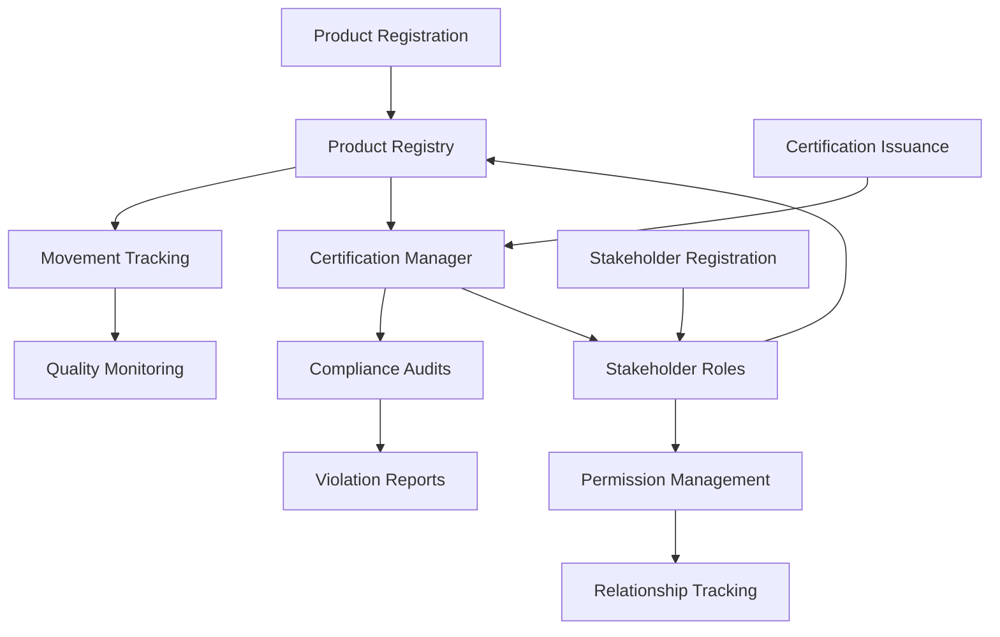

# Transparent Supply Chain Tracker

  

An end-to-end supply chain transparency platform that tracks products from manufacturing to consumer delivery using blockchain immutability. Manufacturers, distributors, retailers, and consumers can verify product authenticity, origin, and handling conditions throughout the entire supply chain. The platform includes features for quality certifications, recall management, and consumer trust scoring based on transparent product histories.

## 🌟 Key Features

### 📦 Complete Product Lifecycle Tracking
- **Manufacturing to Consumer**: Track every stage from production to final sale
- **Immutable Records**: Blockchain-based record keeping prevents tampering
- **Real-Time Visibility**: Live tracking of product location and status
- **Batch Management**: Track products by batches with comprehensive metadata

### 🏅 Comprehensive Certification Management
- **Multi-Standard Support**: ORGANIC, ISO, HACCP, Fair Trade, Halal, Kosher, and more
- **Authorized Issuers**: Verified certification authorities with reputation scoring
- **Audit Trails**: Complete history of all certification audits and renewals
- **Compliance Monitoring**: Automated violation detection and reporting

### 👥 Stakeholder Permission System
- **Role-Based Access**: Manufacturer, Distributor, Retailer, Auditor, Consumer roles
- **KYC Verification**: Multi-level identity verification system
- **Reputation Scoring**: Performance-based trust metrics
- **Relationship Management**: Business relationship tracking and trust levels

### 🔒 Advanced Security & Compliance
- **GPS Tracking**: Precise location tracking with coordinates
- **Temperature Monitoring**: Cold chain compliance for sensitive products
- **Quality Alerts**: Real-time quality issue notifications
- **Recall Management**: Rapid product recall capabilities

## 🏗️ Architecture Overview

The platform consists of three interconnected smart contracts working together to provide comprehensive supply chain transparency:



### Core Contracts

#### 1. Product Registry (`product-registry.clar`) - 409 lines
**Purpose**: Core contract that registers products with unique identifiers and tracks their movement through various stages of the supply chain.

**Key Capabilities**:
- ✅ Product registration with batch tracking
- ✅ 10-stage supply chain movement tracking  
- ✅ GPS location recording with coordinates
- ✅ Quality scoring and temperature monitoring
- ✅ Recall management system
- ✅ Stakeholder authorization per product

**Supply Chain Stages**:
1. **Manufactured** - Initial production
2. **Quality Checked** - Quality assurance testing  
3. **Packaged** - Product packaging completion
4. **Shipped** - Dispatch from manufacturer
5. **In Transit** - Transportation phase
6. **Customs Cleared** - International clearance
7. **Warehoused** - Storage at distribution center
8. **Distributed** - Regional distribution
9. **Retail Ready** - Available for sale
10. **Sold** - Final consumer purchase

#### 2. Certification Manager (`certification-manager.clar`) - 442 lines
**Purpose**: Manages quality certifications, compliance documents, and third-party verifications for products and supply chain participants.

**Key Capabilities**:
- ✅ Multi-standard certification system (10+ certification types)
- ✅ Authorized issuer management with reputation tracking
- ✅ Comprehensive audit trail system
- ✅ Compliance violation reporting and tracking
- ✅ Certificate renewal and revocation management
- ✅ Performance-based issuer scoring

**Supported Certifications**:
- **ORGANIC** - Organic certification
- **ISO_9001** - Quality management systems  
- **HACCP** - Food safety standards
- **FAIR_TRADE** - Ethical trading practices
- **HALAL** - Islamic dietary compliance
- **KOSHER** - Jewish dietary laws
- **NON_GMO** - Non-genetically modified
- **SUSTAINABILITY** - Environmental standards

#### 3. Stakeholder Roles (`stakeholder-roles.clar`) - 555 lines
**Purpose**: Defines and manages permissions for different supply chain participants including manufacturers, distributors, retailers, and auditors.

**Key Capabilities**:
- ✅ 10 distinct stakeholder roles with custom permissions
- ✅ Multi-level KYC verification system  
- ✅ Reputation scoring and performance tracking
- ✅ Business relationship management
- ✅ Notification and alert system
- ✅ Delegation and authorization controls

**Stakeholder Roles**:
- **MANUFACTURER** - Product creators
- **SUPPLIER** - Raw material providers
- **DISTRIBUTOR** - Product distributors  
- **RETAILER** - Final point of sale
- **LOGISTICS** - Transportation providers
- **AUDITOR** - Quality inspectors
- **CERTIFIER** - Certification authorities
- **REGULATOR** - Compliance oversight
- **CONSUMER** - End users
- **ADMIN** - System administrators

## 🔧 Contract APIs

### Product Registry API

| Function | Parameters | Returns | Description |
|----------|------------|---------|-------------|
| `register-product` | `product-id, name, category, batch-id, expiry-date, temp-sensitive, organic` | `product-id` | Register new product in system |
| `move-product` | `product-id, stage, location, holder, transport-method, temp, quality-check` | `movement-id` | Move product to next supply chain stage |
| `get-product` | `product-id` | `product-data` | Get complete product information |
| `get-product-movement` | `product-id, movement-id` | `movement-data` | Get specific movement record |
| `raise-quality-alert` | `product-id, alert-type, severity, description` | `alert-id` | Report quality issues |
| `recall-product` | `product-id, reason` | `bool` | Initiate product recall |
| `update-product-location-gps` | `product-id, lat, lng, address, facility-type` | `bool` | Update GPS coordinates |

### Certification Manager API

| Function | Parameters | Returns | Description |
|----------|------------|---------|-------------|
| `issue-certification` | `cert-id, product-id, entity, type, expiry, score, level, hash` | `cert-id` | Issue new certification |
| `register-certification-issuer` | `issuer, name, type, authorized-certs, accreditation` | `issuer` | Register certification authority |
| `conduct-certification-audit` | `cert-id, audit-type, findings, score, pass, actions` | `audit-id` | Conduct certification audit |
| `revoke-certification` | `cert-id, reason` | `bool` | Revoke invalid certification |
| `renew-certification` | `cert-id, new-expiry, score, hash` | `bool` | Renew existing certification |
| `report-compliance-violation` | `entity, type, severity, description` | `violation-id` | Report compliance violations |

### Stakeholder Roles API

| Function | Parameters | Returns | Description |
|----------|------------|---------|-------------|
| `register-stakeholder` | `stakeholder, role, company, reg-num, contact, email, address` | `stakeholder` | Register new stakeholder |
| `activate-stakeholder` | `stakeholder` | `bool` | Activate pending stakeholder |
| `update-kyc-status` | `stakeholder, level, validity` | `bool` | Update KYC verification |
| `establish-relationship` | `other-stakeholder, type, trust-level` | `bool` | Create business relationship |
| `grant-custom-permission` | `stakeholder, permission` | `bool` | Grant additional permissions |
| `check-permission` | `stakeholder, permission` | `bool` | Verify stakeholder permissions |
| `record-transaction-performance` | `stakeholder, success, processing-time` | `bool` | Track performance metrics |

## 📊 System Features

### Real-Time Tracking
- **GPS Coordinates**: Precise location tracking with latitude/longitude
- **Movement History**: Complete audit trail of all product movements
- **Status Updates**: Real-time supply chain stage notifications
- **Quality Monitoring**: Temperature and condition tracking

### Quality Assurance
- **Quality Scoring**: 0-100 scoring system for products and stakeholders  
- **Alert System**: 5-level severity alerting (1=low, 5=critical)
- **Batch Tracking**: Quality management by production batches
- **Recall Management**: Rapid response to quality issues

### Compliance Management
- **Multi-Standard Support**: Support for major international standards
- **Issuer Verification**: Authorized certification authorities only
- **Audit Requirements**: Regular compliance auditing
- **Violation Tracking**: Comprehensive violation recording

### Stakeholder Management
- **KYC Levels**: 5-tier verification system (None to Institutional)
- **Reputation System**: Performance-based trust scoring (0-100)
- **Role Permissions**: Granular access control system
- **Relationship Tracking**: Business partnership management

## 🚀 Deployment Guide

### Prerequisites
- [Clarinet](https://github.com/hirosystems/clarinet) v2.0+
- Node.js v18+
- Stacks wallet for testing

### Local Development

```bash
# Clone repository
git clone <repository-url>
cd transparent-supply-chain-tracker

# Install dependencies
npm install

# Run tests
npm test

# Check contracts
clarinet check

# Deploy to testnet
clarinet deploy --testnet
```

### Configuration

```toml
# Clarinet.toml
[project]
name = "transparent-supply-chain-tracker"
description = "End-to-end supply chain transparency platform"

[[project.requirements]]
contract_id = "product-registry"
clarity_version = 2
epoch = "2.1"

[[project.requirements]]
contract_id = "certification-manager" 
clarity_version = 2
epoch = "2.1"

[[project.requirements]]
contract_id = "stakeholder-roles"
clarity_version = 2
epoch = "2.1"
```

### Mainnet Deployment Checklist

- [ ] All unit tests passing
- [ ] Integration testing completed
- [ ] Security audit performed
- [ ] Stakeholder permissions configured
- [ ] Certification authorities registered
- [ ] Monitoring systems deployed
- [ ] Support documentation complete

## 🔐 Security Considerations

### Access Control
- **Role-Based Permissions**: Granular access control per stakeholder type
- **Multi-Level Authorization**: KYC verification requirements
- **Product Authorization**: Per-product stakeholder permissions
- **Admin Controls**: System-wide pause/unpause capabilities

### Data Integrity
- **Immutable Records**: Blockchain storage prevents tampering
- **Hash Verification**: Document integrity through hash storage
- **Audit Trails**: Complete history of all changes
- **Timestamp Validation**: Block-height based timing

### Quality & Safety
- **Real-Time Alerts**: Immediate quality issue notifications
- **Recall Capabilities**: Rapid product recall mechanisms
- **Temperature Monitoring**: Cold chain compliance tracking
- **Certification Verification**: Authorized issuer validation

### Privacy Protection
- **Selective Disclosure**: Granular information sharing controls
- **Stakeholder Consent**: Permission-based data access
- **Compliance Standards**: GDPR and data protection compliance
- **Audit Logging**: Comprehensive activity tracking

## 📈 Use Cases & Benefits

### For Manufacturers
- **Brand Protection**: Prevent counterfeiting and fraud
- **Quality Control**: Monitor product quality throughout supply chain
- **Compliance**: Automated regulatory compliance tracking
- **Recall Management**: Rapid response to quality issues

### For Distributors & Retailers
- **Supply Verification**: Confirm product authenticity and origin
- **Quality Assurance**: Access to complete product quality history
- **Efficiency**: Streamlined certification and compliance processes
- **Trust Building**: Enhanced consumer confidence through transparency

### For Consumers
- **Product Authentication**: Verify product genuineness
- **Origin Tracking**: Complete supply chain visibility
- **Quality Information**: Access to quality scores and certifications
- **Safety Assurance**: Real-time recall and safety alerts

### For Regulators
- **Compliance Monitoring**: Automated regulatory oversight
- **Investigation Tools**: Complete audit trails for investigations
- **Risk Assessment**: Data-driven risk analysis capabilities
- **Market Surveillance**: Real-time market monitoring

## 🧪 Testing & Quality Assurance

### Contract Validation
- ✅ All contracts compile successfully
- ✅ Comprehensive error handling
- ✅ Input validation and sanitization
- ✅ Access control verification

### Integration Testing
- [ ] Cross-contract interaction testing
- [ ] End-to-end workflow validation
- [ ] Performance and gas optimization
- [ ] Security vulnerability assessment

### User Acceptance Testing
- [ ] Manufacturer workflow testing
- [ ] Distributor and retailer workflows
- [ ] Consumer interaction testing
- [ ] Regulatory compliance validation

## 📊 Performance Metrics

### System Capabilities
- **Product Tracking**: Unlimited products with full history
- **Certification Management**: Support for 20+ certification types
- **Stakeholder Management**: Unlimited stakeholders with role-based access
- **Performance Tracking**: Real-time metrics and reputation scoring

### Scalability Features
- **Batch Processing**: Efficient batch operations
- **Modular Design**: Independent contract deployment
- **Optimized Storage**: Efficient data structure design
- **Gas Optimization**: Minimal transaction costs

## 🤝 Contributing

We welcome contributions from the supply chain and blockchain communities!

### Development Guidelines
- Follow Clarity best practices
- Comprehensive test coverage
- Clear documentation and comments
- Security-first approach

### Getting Involved
1. Fork the repository
2. Create feature branch
3. Implement changes with tests
4. Submit pull request with detailed description

## 📄 License

This project is licensed under the MIT License - see the [LICENSE](LICENSE) file for details.

## 📞 Support

- **Documentation**: [docs.supply-chain-tracker.com](https://docs.supply-chain-tracker.com)
- **Community**: [Discord](https://discord.gg/supply-chain-tracker)
- **Issues**: [GitHub Issues](https://github.com/supply-chain-tracker/issues)
- **Email**: support@supply-chain-tracker.com

---

**Building Trust Through Transparency on the Stacks Blockchain** 🔗## Feature Branch

This branch contains the complete implementation of the supply chain tracker with all contracts and documentation.
